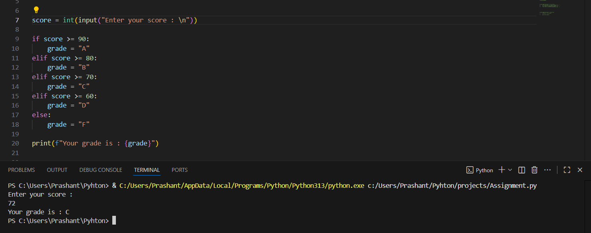
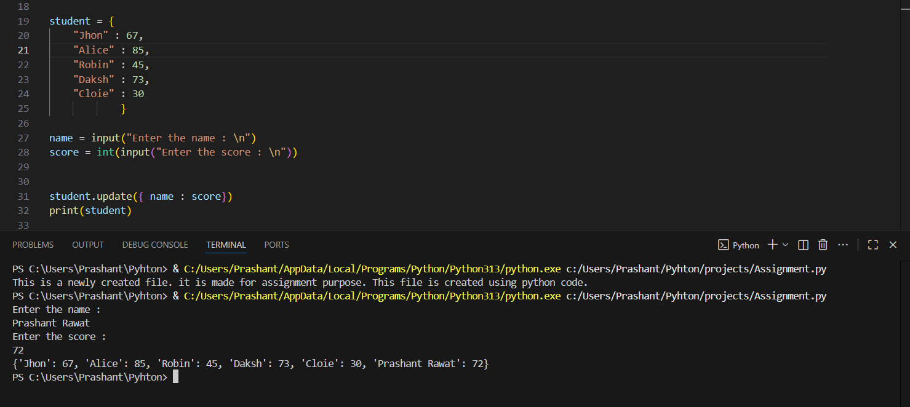

# Python and Bash
                                                                                Date : 11-Oct-2025


##### 1. Grade Checker
Take a score as input and print the grade based on the following:
90+ : "A"
80-89 : "B"
70-79 : "C"
60-69 : "D"
Below 60 : "F"

here we used a basic if else statement to carry out marks and all.


**Solution :** 
```
score = int(input("Enter your score : \n"))

if score >= 90:
    grade = "A"
elif score >= 80:
    grade = "B"
elif score >= 70:
    grade = "C"
elif score >= 60:
    grade = "D"
else:
    grade = "F"
            
print(f"Your grade is : {grade}")
```




##### 2. Student Grades
Create a dictionary where the keys are student names and the values are their grades. Allow the user to:

Add a new student and grade.
Update an existing student’s grade.
Print all student grades.

Used dictionary and basic operations. Using if else:


**Solution :**
```
student = {
    "Jhon" : 67,
    "Alice" : 85,
    "Robin" : 45,
    "Daksh" : 73,
    "Cloie" : 30
            }

name = input("Enter the name : \n")             # name and score are input from user
score = int(input("Enter the score : \n"))


student.update({ name : score})                 # this command add/update them to the dictionary
print(student)
```




##### 3. Write to a File
Write a program to create a text file and write some content to it.

Using file functions like write and open.


**Solution :**


```
with open("file.txt", "w") as file:                         # "w" represent write 
    file.write("This is a newly created file. " \           # \ is used to show that the same command and same bracket is being used
    "it is made for assignment purpose. " \
    "This file is created using python code. " )
```


As you can see there is a new file "file.txt". As for the file content...


##### 4. Read from a file
We used open in read mode and file.read to read and print to display.


**Solution :**
```
with open("file.txt", "r")as file:              # open the file with permission to read only"r"
    print(file.read())
```


